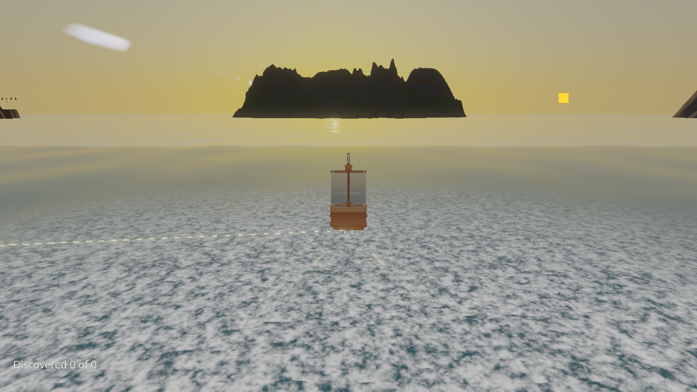
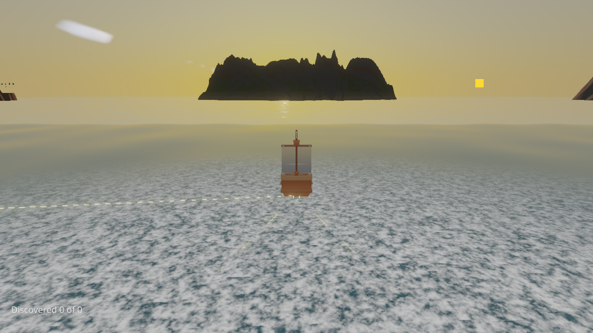
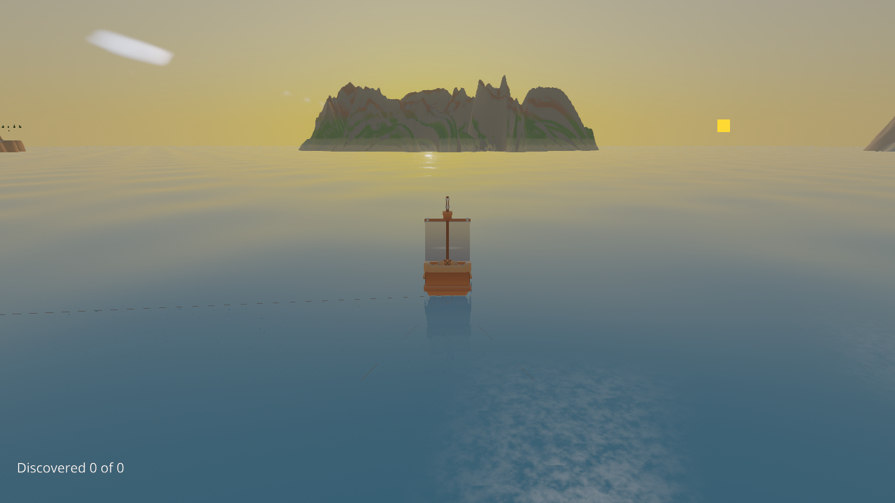
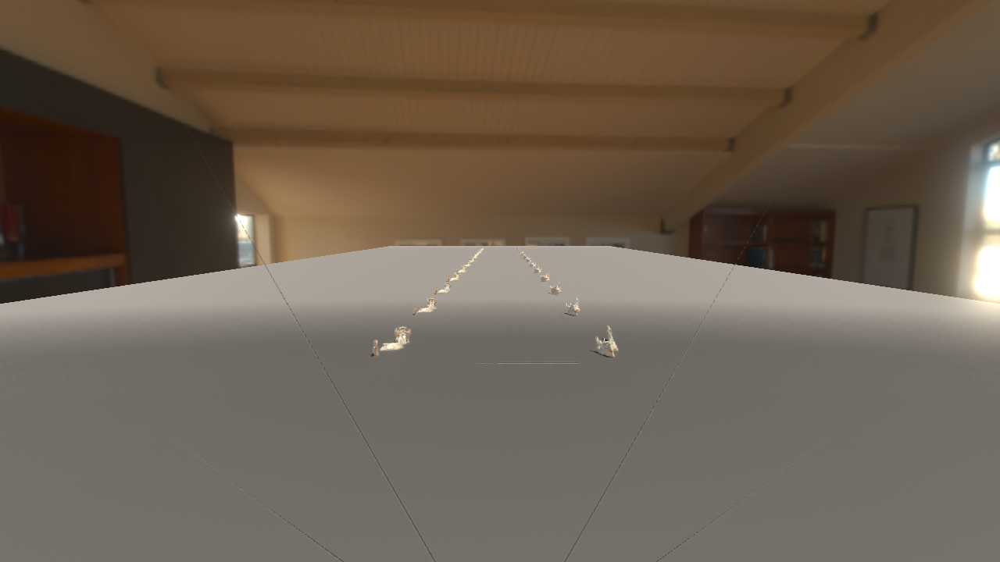
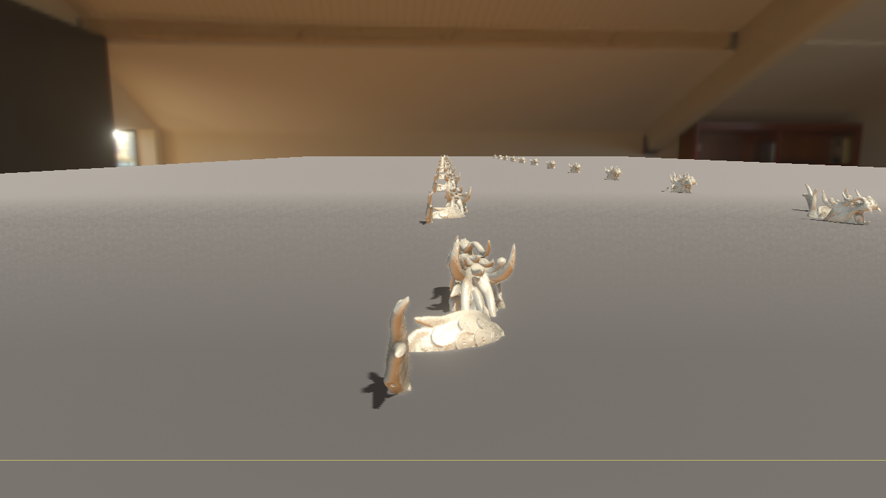

# Validation after master integration

The integrated code at `1bd20ac1d` passed 215 Vulkan and descriptor-heap tests in
each layout mode, with zero skips or failures and exit 0. The unified run took
216.225 seconds and forced-off took 102.722 seconds; these are test-suite durations,
not GPU performance measurements. The XML reports are retained here.

Release OloEditor and Debug OloEditor, OloEngine-Tests, OloRuntime and OloServer
were rebuilt after the heap lifecycle fix; both build commands exited 0 and
dependency checks passed. The Debug editor binary hash is in [results.json](results.json).
That file also records the source revision, startup policy logs, validation DLL,
per-scene diagnostics, capture liveness and PNG hashes.

Fresh Debug editor processes exercised both unified and runtime-forced-off modes:

| Scene | Render paths | Result in both modes |
| --- | --- | --- |
| Drift | Forward, Forward+, Deferred | Zero shader errors, render hazards, resolve failures and consumed-but-unbacked resources |
| VirtualGeometryStress with fetched dragon | Deferred | Same zero-error checks; populated virtual geometry |

Khronos validation 1.4.357.0 was confirmed loaded in both processes, with Debug
synchronization validation enabled. Neither engine log contained VUID,
SYNC-HAZARD or device-loss errors. Existing MissingProducer and outside-recording
diagnostics remain visible in the retained results; this does not claim to fix
the separately tracked device-loss issue #1198.

The first forced-off live attempt was minimized during warm-up and remained
minimized after restoration and repeated warm-up. It exited 1 with no accepted
samples. A fresh forced-off process completed all four scenes, exit 0. The
successful unified and forced-off images were inspected. The five selected PNGs
below report `stale=false` and a visible, ticking, non-minimized editor. Screenshot
metadata retains `captureUnready` rather than suppressing it.

This is correctness and visual validation of the integrated revision. The
[timing experiment](../timings/README.md) predates master integration and remains
inconclusive; these short Debug checks add no performance claim.

