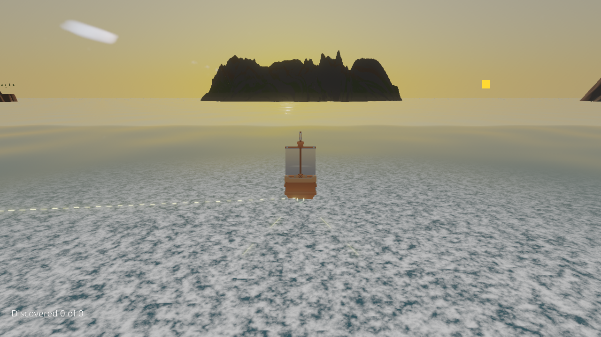
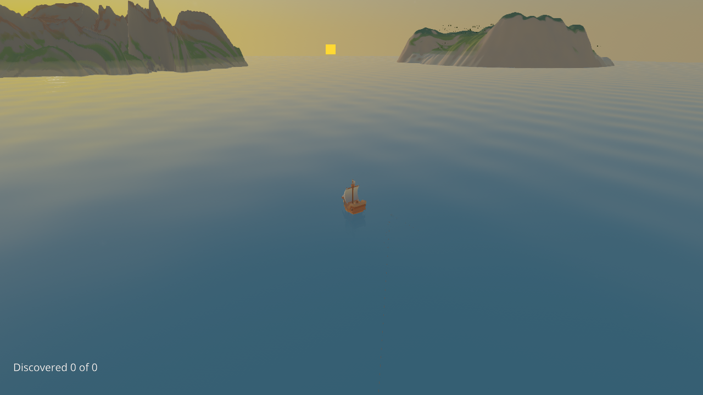

# Unified image layouts: timing evidence

Timing results are **inconclusive**: both improvements and slowdowns were observed,
including a higher Deferred aggregate median. These measurements establish neither
a reproducible performance benefit nor the absence of a regression.

Collected on 2026-09-13 using Release binaries, an RTX 4090, NVIDIA 616.64 and
Vulkan 1.4.351. The git control is `433c3e67d0efbc966d922242f15ed1d75279bdfa`;
the candidate contains the image-layout implementation from `60f51319b`.
**These measurements precede integration of master PR #1210's descriptor sub-rings.**
They isolate the original policy change; they are not performance measurements of
the final merged revision. The [validation guide](../../../../../../docs/guides/unified-image-layouts-validation.md)
records correctness checks separately.

## Method

Each scene has three interleaved git-control/unified pairs and one candidate run
with `OLO_VULKAN_NO_UNIFIED_IMAGE_LAYOUTS=1`. Every accepted scene arm has at least
60 seconds of warm-up and 30 samples: 21 scene arms, 630 samples in total. The
viewport is 1280 x 720, PCSS is selected, Drift time of day is paused at 5.2 hours,
and camera poses are fixed. Forward+ has separate correctness and visual coverage;
these timing experiments cover Forward, Deferred and populated VirtualGeometry
Deferred (24 instances, 593 drawn clusters, 2,834,448 tested clusters).

The [manifest](manifest.json) records accepted pairs and rejected attempts.
Other editor, test and compiler processes were monitored approximately every
2 seconds plus process-query overhead. An observed overlap from scene loading
through final diagnostics, with a 2-second margin, rejects that scene. Accepted
scenes have no observed overlap; polling cannot rule out every short-lived process.
Minimized-window attempts were rejected, and only the owned editor window was
restored before repeating warm-up. All accepted samples have fresh pass timestamps,
zero reported shader errors and zero reported render hazards.

## Results

Numbers below are medians of 30 observations per run, in milliseconds. A positive
percentage means the unified run was slower than its paired git control.

| Workload / metric | Control run medians | Unified run medians | Paired changes |
| --- | --- | --- | --- |
| Drift Forward / frame GPU | 93.062, 93.572, 130.275 | 97.220, 130.173, 91.145 | +4.47%, +39.11%, -30.04% |
| Drift Deferred / frame GPU | 101.761, 132.486, 94.659 | 93.470, 130.044, 133.325 | -8.15%, -1.84%, +40.85% |
| VirtualGeometry Deferred / sum of pass GPU durations | 1.8230, 1.8700, 1.2775 | 1.4625, 1.8150, 1.4370 | -19.78%, -2.94%, +12.49% |

The median of the run medians is 3.9% higher for Forward frame GPU time and 27.8%
higher for Deferred. Deferred's third paired sum of pass durations is also 56.5%
higher; these slower observations are retained. Control frame medians themselves
vary by approximately 40% on both Drift paths, so a feature-specific cause cannot
be assigned from this experiment.

| Forced-off candidate | Frame GPU median | Sum of pass GPU durations | Valid frame GPU samples |
| --- | --- | --- | --- |
| Drift Forward | 54.1465 | 5.5090 | 30 / 30 |
| Drift Deferred | 91.7165 | 15.4960 | 30 / 30 |
| VirtualGeometry Deferred | unavailable | 1.7345 | 0 / 30 |

The much faster forced-off Forward run had two in-sample GPU telemetry observations
at P0, 2565 MHz graphics / 10501 MHz memory. Earlier accepted sample windows had
16 P5, 10 P8, one P3 and one P0 observation. Operating conditions were therefore
not matched. This sparse telemetry does not prove the cause of the differences,
and the forced-off result cannot isolate the layout feature's effect. No GPU
clock locks, power-policy changes or CPU-affinity changes were applied.

All 180 control and 180 unified Drift frame GPU samples are valid; the forced-off
run adds 60 valid samples. VirtualGeometry whole-frame
timestamps are missing in all 90 control samples and 89 of 90 unified samples;
the remaining single unified reading is insufficient for a comparison. Zeros
remain in the raw table and are excluded from valid-frame medians. Summed pass
durations are useful diagnostics, but do not measure elapsed frame time when
queues overlap or CPU submission gaps exist. They never replace missing frame
timestamps.

## Files and forced-off captures

- [Frame samples](frame-samples.csv) and [individual pass samples](pass-samples.csv)
  retain the accepted observations and timestamps.
- [Per-run summaries](run-summary.json) and [aggregates](aggregate.json) retain
  unrounded medians, valid sample counts and paired changes.
- [GPU telemetry](gpu-telemetry.csv) covers accepted scene intervals.
- [Sources](sources.json) records raw timing-file SHA-256 hashes, accepted scene
  intervals, warm-up settings and process-monitor evidence.
- The three PNGs below are selected original forced-off captures. Their adjacent
  JSON files preserve the full screenshot metadata, including `captureUnready`.
  All report `stale=false` with a visible, ticking, non-minimized editor, and all
  three images were inspected. Their hashes are in [captures.json](captures.json).

