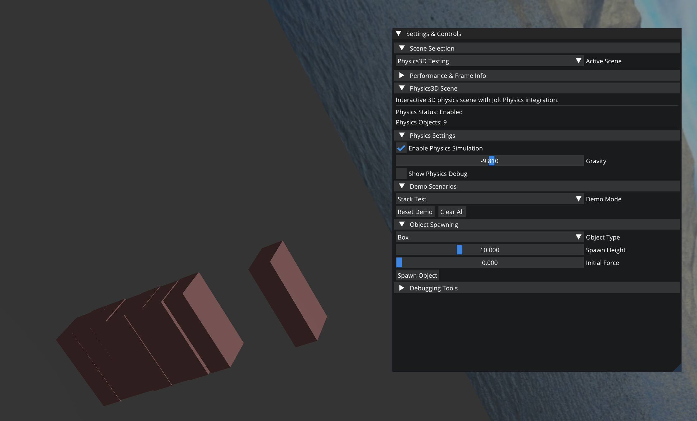
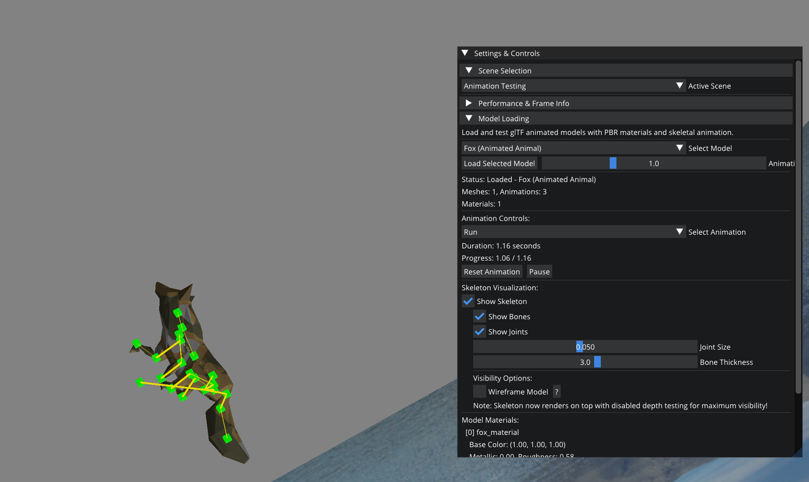
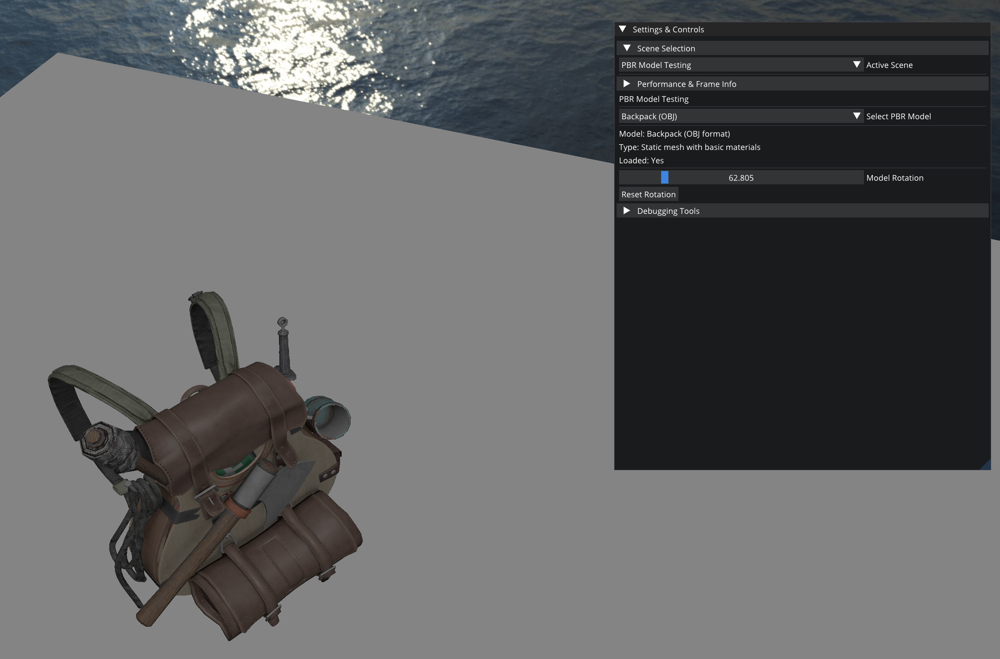

# OloEngine
OloEngine is primarily an early-stage interactive application and rendering engine for Windows based on [Hazel](https://github.com/TheCherno/Hazel/).

## Screenshots

### 3D Physics Integration

### Animated Models

### PBR Material Rendering

## Getting Started
Requirements:
- Python 3.10+, with the 'jinja2' package installed (needed for building glad2)
- CMake 3.25+ (soon 4.2+ needed for Visual Studio 2026 support)
- Vulkan SDK (for SPIR-V shader compilation)

You can clone the repository to a local destination using git:

`git clone https://github.com/drsnuggles8/OloEngineBase`

This project uses [CMake](https://cmake.org/download/) to build the project's solution files. There's a batch script `scripts/Win-GenerateProject.bat` that will generate the solution file for Visual Studio 2022.

**Visual Studio Code Users:** The project includes predefined VS Code tasks for building and running. Use tasks like `build-sandbox3d-debug`, `run-oloeditor-release`, etc. from the Command Palette (Ctrl+Shift+P → "Tasks: Run Task").

**CLion Users:** Open the OloEngineBase folder, let CLion initialize the CMake project, then edit the run configurations by changing the working directory of the OloEditor application to be the OloEditor folder.

CMake downloads all dependencies via FetchContent and CPM (CMake Package Manager) and stores them in the `OloEngine/vendor/` directory.
CMake will also create the `build/` directory, which contains the Visual Studio solution files.

## Current Features

### Core Engine
- **Entity-Component-System (ECS)**: Built on EnTT for high-performance entity management
- **Multi-threaded Asset System**: Async loading with hot-reload support via filewatch
- **Dual Scripting Support**: C# scripting via Mono integration + Lua scripting via Sol2
- **Comprehensive Serialization**: YAML-based scene and entity serialization
- **Advanced Memory Management**: Custom allocators and RAII resource management

### Rendering
- **OpenGL-based Renderer**: Modern OpenGL 4.6 with SPIR-V shader compilation
- **Physically-Based Rendering (PBR)**: Advanced material system with metallic-roughness workflow
- **Multi-threaded Command Queue**: Stateless, layered rendering architecture based on [Molecular Matters' design](https://blog.molecular-matters.com/2014/11/06/stateless-layered-multi-threaded-rendering-part-1/)
- **2D/3D Rendering Support**: Unified pipeline for both 2D sprites and 3D models
- **Animated Models**: Skeletal animation system with Assimp integration

### Physics
- **3D Physics**: Jolt Physics integration for rigid body dynamics
- **2D Physics**: Box2D integration for 2D game mechanics
- **Custom Collision Layers**: Flexible collision filtering and detection

### Editor & Tools
- **Full-Featured Editor**: ImGui-based editor with scene hierarchy and content browser
- **Visual Scene Editing**: Gizmos, transform tools, and real-time scene manipulation
- **Asset Management**: Comprehensive asset browser with drag-and-drop functionality
- **Profiling & Debugging**: Tracy profiler integration with custom renderer profilers
- **Memory Tracking**: Real-time GPU/CPU memory usage visualization

### Audio
- **3D Audio System**: Miniaudio-based with spatial audio support
- **Audio Components**: Source and listener components for ECS integration

### UI System
- **ECS-Based UI**: 13 widget component types (Canvas, Panel, Text, Image, Button, Slider, Checkbox, Toggle, Progress Bar, Input Field, Dropdown, Scroll View, Grid Layout)
- **Anchor Layout**: RectTransform-style anchoring, pivot, and auto-layout via grid containers
- **Editor Integration**: "Create UI" context menu, per-component property panels, editor-time preview in both 2D and 3D modes
- **Scripting Support**: Full C# (Mono) and Lua (Sol2) bindings for all UI components

## Future Features
- Procedural terrain and world generation
- Advanced OpenGL (compute shaders, ARB)
- Advanced AI systems
- Networking capabilities
- Enhanced particle systems
- Advanced post-processing pipeline
- Scripting debugger and hot-reload
- Asset streaming and LOD systems
- Advanced lighting (global illumination, ray tracing)

## Dependencies

All dependencies are automatically fetched via fetchcontent and CPM (CMake Package Manager, only used for Sol) and stored in `OloEngine/vendor/`:

### Core Libraries
* [entt](https://github.com/skypjack/entt) - Fast and reliable entity-component system (ECS)
* [glm](https://github.com/g-truc/glm) - OpenGL Mathematics library for graphics transformations
* [spdlog](https://github.com/gabime/spdlog) - Fast C++ logging library
* [yaml-cpp](https://github.com/jbeder/yaml-cpp) - YAML parser and emitter for serialization

### Rendering & Graphics
* [glad](https://github.com/Dav1dde/glad) - OpenGL loader and meta loader
* [glfw](https://github.com/glfw/glfw) - Multi-platform library for OpenGL, window and input
* [assimp](https://github.com/assimp/assimp) - 3D model importing with scene post-processing
* [stb](https://github.com/nothings/stb) - Single-file public domain libraries (stb_image for textures)
* [freetype](https://gitlab.freedesktop.org/freetype/freetype) - Font rendering library
* [msdf-atlas-gen](https://github.com/Chlumsky/msdf-atlas-gen) - Multi-channel signed distance field atlas generator
* [msdfgen](https://github.com/Chlumsky/msdfgen) - Multi-channel signed distance field generator
* [libpng](http://www.libpng.org/pub/png/libpng.html) - PNG image codec
* [zlib](https://www.zlib.net/) - Compression library

### Physics
* [joltphysics](https://github.com/jrouwe/JoltPhysics) - Multi-platform 3D physics engine
* [box2d](https://github.com/erincatto/Box2D) - 2D physics engine for games

### Audio
* [miniaudio](https://github.com/mackron/miniaudio) - Single-file audio playback and capture library

### Scripting
* [sol2](https://github.com/ThePhD/sol2) - C++ ↔ Lua API wrapper with advanced features
* [lua](https://www.lua.org/) - Lightweight, embeddable scripting language
* **Mono** - C# scripting runtime (manually integrated)

### UI & Editor
* [imgui](https://github.com/ocornut/imgui) - Immediate mode GUI for tools and debugging
* [imguizmo](https://github.com/CedricGuillemet/ImGuizmo) - Immediate mode 3D gizmo for scene editing

### Development & Profiling
* [tracy](https://github.com/wolfpld/tracy) - Real-time profiler with nanosecond resolution
* [googletest](https://github.com/google/googletest) - Google Testing and Mocking Framework
* [filewatch](https://github.com/ThomasMonkman/filewatch) - File system monitoring for hot-reload
* [tinyxml2](https://github.com/leethomason/tinyxml2) - Simple, small XML parser

### Code formatting & pre-commit hooks ✅

We trim trailing whitespace and enforce a few formatting rules via `pre-commit` hooks.

- Install pre-commit locally (Python/pip required):
  - `python -m pip install --user pre-commit`
  - `pre-commit install` in the repo root to enable the git hook
  - Optionally run `pre-commit run --all-files` to apply the hooks across the repo

Included hooks/config:
- `trailing-whitespace` (removes trailing spaces)
- `end-of-file-fixer` (ensure final newline)
- `clang-format` for C/C++ (configured to use `.clang-format` in the repo root)

We also include a `.editorconfig` to configure editor behavior (trim trailing whitespace, insert final newline). The pre-commit hooks **ignore the `vendor/`, `.vs/`, `.vscode/`, `build/`, and other generated/IDE folders** to avoid touching third-party or editor metadata.

A GitHub Action runs `pre-commit` on push and pull requests so formatting checks run on PRs automatically.

 ## Influences & References
  * [Hazel](https://github.com/TheCherno/Hazel) - As mentioned, this game engine follows The Cherno's game engine series as a foundation
  * [Lumos](https://github.com/jmorton06/Lumos) - Ideas for OpenGL rendering implementation and engine architecture
  * [Arc](https://github.com/MohitSethi99/ArcGameEngine) - Ideas for the audio engine implementation
  * [Molecular Matters Blog](https://blog.molecular-matters.com/2014/11/06/stateless-layered-multi-threaded-rendering-part-1/) - Core inspiration for the multi-threaded render command queue architecture
