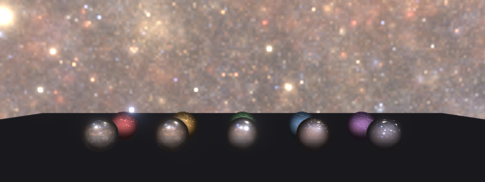
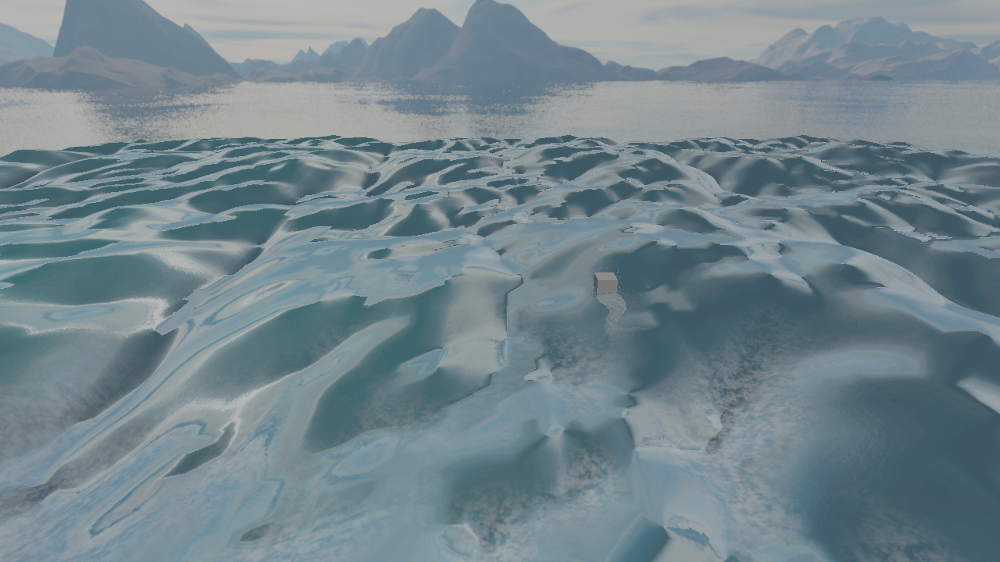

# OloEngine

[](https://github.com/drsnuggles8/OloEngineBase/actions/workflows/Windows.yml)
[](https://github.com/drsnuggles8/OloEngineBase/actions/workflows/asan.yml)
[](https://github.com/drsnuggles8/OloEngineBase/actions/workflows/cross-vendor.yml)
[](https://github.com/drsnuggles8/OloEngineBase/actions/workflows/fuzz.yml)
[](https://github.com/drsnuggles8/OloEngineBase/actions/workflows/SonarCloud.yml)
[](https://github.com/drsnuggles8/OloEngineBase/actions/workflows/pre-commit.yml)

**OloEngine** is a cross-platform (Windows / Linux) C++23 interactive-application and rendering engine. It started as a follow-along of [Hazel](https://github.com/TheCherno/Hazel/) but has since grown well past that scope into a full ECS-driven engine with a physically-based OpenGL 4.6 renderer, 2D/3D physics, dual C#/Lua scripting, networking, navigation, procedural terrain and environmental systems, a gameplay/AI stack, and an ImGui editor.

## Screenshots

Metallic and dielectric PBR spheres (a roughness sweep) reflecting a procedural star-nest sky:



| PBR model | Animated models | 3D physics | FFT ocean |
| --- | --- | --- | --- |
|  |  |  |  |

## Table of contents

- [Repository layout](#repository-layout)
- [Getting started](#getting-started)
- [Building & running](#building--running)
- [Features](#features)
- [Testing](#testing)
- [Tooling](#tooling)
- [Dependencies](#dependencies)
- [Code style & pre-commit hooks](#code-style--pre-commit-hooks)
- [Documentation](#documentation)
- [Influences & references](#influences--references)

## Repository layout

| Target / directory | What it is |
| --- | --- |
| `OloEngine/` | The engine static library (`OloEngine`). All subsystems live under `src/OloEngine/<Subsystem>/`; platform glue under `src/Platform/`. |
| `OloEditor/` | ImGui-based editor (`OloEditor`). Panels under `src/`, runtime assets under `assets/`, a sample game under `SandboxProject/`. |
| `OloRuntime/` | Standalone game runtime (`OloRuntime`) that loads what the editor builds. |
| `OloServer/` | Headless dedicated server (`OloServer`) — the one target that also runs on WSL2. |
| `OloEngine-ScriptCore/` | C# scripting runtime library (Windows only, Visual Studio generator). |
| `OloEngine-LuaScriptCore/` | Lua scripting core (all platforms). |
| `OloEngine/tests/` | GoogleTest suite (`OloEngine-Tests`). |
| `tools/` | Build-time tooling, notably `OloHeaderTool` (code generation — see [Tooling](#tooling)). |
| `docs/` | Design docs, ADRs, build/testing guides, and agent rules — see [Documentation](#documentation). |

## Getting started

**Supported platforms**

- **Windows** — Visual Studio 2026 (the default `msvc` preset) or Visual Studio 2022.
- **Linux** — GCC 14+.
- **WSL2** — can compile every target and run `OloServer`, but **not** `OloEditor`: WSL2's software renderer only exposes OpenGL 4.5, and the editor requires a native OpenGL 4.6 GPU.

**Requirements**

- **CMake 4.2+** — required by `CMakePresets.json` (the `msvc` preset's `Visual Studio 18 2026` generator only exists in 4.2+). The root `CMakeLists.txt` itself only requires 3.25, so a plain `cmake -B build -G "Visual Studio 17 2022"` still works without presets.
- **Python 3.10+** with the `jinja2` package (needed to build glad2).
- **Vulkan SDK** — for SPIR-V shader compilation.

**Clone**

```sh
git clone https://github.com/drsnuggles8/OloEngineBase
```

All third-party dependencies are fetched automatically at configure time via CMake `FetchContent` and CPM, and stored under `OloEngine/vendor/` (**never edit that directory — a CMake reconfigure wipes it**). CMake also creates the `build/` directory with the generated solution files.

## Building & running

CMake presets ([`CMakePresets.json`](CMakePresets.json)):

| Preset | Generator / build dir | Purpose |
| --- | --- | --- |
| `msvc` | Visual Studio 18 2026 → `build/` | Primary, default build dir |
| `clangcl` | Ninja Multi-Config → `build-clang/` | clang-cl warnings with the MSVC ABI |
| `clangcl-asan` | Ninja Multi-Config → `build-clang/` | Adds AddressSanitizer |

```powershell
# Generate the Visual Studio solution
scripts\Win-GenerateProjectVS2026.bat        # or Win-GenerateProjectVS2022.bat

# Build a target
cmake --build build --target OloEditor       --config Debug --parallel
cmake --build build --target OloEngine-Tests --config Debug --parallel
cmake --build build --target OloRuntime      --config Debug --parallel
cmake --build build --target OloServer       --config Debug --parallel

# ClangCL (configure once, then build)
cmake --preset clangcl
cmake --build build-clang --target OloEngine-Tests --config Debug --parallel
```

> **Working directory matters.** `OloEditor`, `OloRuntime`, and `OloServer` resolve assets, shaders, and Mono assemblies relative to `OloEditor/`. Always run them with `cwd = OloEditor/`. The VS Code tasks already do this.

**VS Code users** — predefined tasks in [`.vscode/tasks.json`](.vscode/tasks.json) wrap all of the above: `build-oloeditor-debug`, `run-oloeditor-debug`, `build-tests-debug`, `run-tests-debug`, `configure-clangcl`, etc. Run them from the Command Palette (`Ctrl+Shift+P` → *Tasks: Run Task*).

**CLion users** — open the repo folder, let CLion configure the CMake project, then set the working directory of the `OloEditor` run configuration to the `OloEditor/` folder.

The full per-OS build matrix (including Linux and WSL specifics) lives in [docs/ops/build.md](docs/ops/build.md).

## Features

### Core engine
- **Entity-Component-System** built on EnTT under a UUID-keyed `Entity` wrapper. The hottest update loops use EnTT owning groups for packed iteration.
- **Deterministic gameplay scheduler** — per-tick systems declare their read/write data flow and the execution order is derived by topological sort, with optional worker-thread parallelism (audited per system) and a physics-shadow phase that steps the physics world alongside game-thread systems.
- **Multi-threaded asset system** — async loading with hot-reload via filewatch; typed retrieval through `AssetManager`.
- **Dual scripting** — C# via Mono (Windows) and Lua via Sol2 (all platforms), with generated bindings.
- **YAML serialization** — scenes, entities, and prefabs. Trivial component (de)serialization, the ECS component tuple, save-game capture/restore lists, and add/remove handlers are all **code-generated** from the component definitions (see [Tooling](#tooling)), so most new components round-trip with zero hand-written glue.
- **Save games** — component-level snapshot/restore with a versioned binary archive format.
- **Custom memory management, threading, and task systems** — custom allocators, RAII resources, a job/task scheduler, and async primitives.

### Rendering
- **Modern OpenGL 4.6** with Direct State Access and SPIR-V shader compilation.
- **Stateless, layered, multi-threaded command queue** ([Molecular Matters' design](https://blog.molecular-matters.com/2014/11/06/stateless-layered-multi-threaded-rendering-part-1/)) driven by a render-graph.
- **Physically-based rendering** — metallic-roughness workflow, image-based lighting (IBL).
- **Deferred + forward paths** with Hi-Z GPU occlusion culling and LOD.
- **Post-processing & advanced lighting** — SSAO, SSR, SSGI, contact shadows, all shadow types (incl. PCSS), TAA, volumetric fog + god rays, screen-space decals, order-independent transparency, and FSR/CAS upscaling.
- **Unified 2D/3D pipeline** — sprites and 3D meshes through one renderer.
- **Skeletal animation** — Assimp-imported skeletons, animation graphs and state machines, additive layers, and humanoid retargeting; secondary motion via spring bones and cloth.
- **GPU-driven particles** — compute-based particle simulation.

### Physics
- **3D** — Jolt Physics for rigid bodies, joints, characters, and vehicles.
- **2D** — Box2D for 2D mechanics.
- **Custom collision layers** for flexible filtering and detection.

### Environmental & world systems
- **Procedural terrain** generation with LOD.
- **Water / FFT ocean** rendering.
- **Weather & environment** — wind, snow (with deformation), and precipitation systems.
- **Streaming volumes**, light-probe volumes, fog volumes, and navigation-mesh bounds as scene-level authored data.

### Gameplay, AI & narrative
- **AI** — GOAP planner / action system and a perception system (sight / sound / awareness).
- **Navigation** — Recast/Detour nav-mesh generation with nav agents.
- **Dialogue & quests**, plus a **localization** system driving `LocalizedTextComponent`.
- **Cinematic sequencer** — timeline-driven cutscenes.

### Networking
- Reliable UDP transport over GameNetworkingSockets, with encrypted transport (libsodium) and a protobuf wire format for snapshots / RPC. `OloServer` provides the headless dedicated-server target.

### Audio & video
- **3D spatial audio** (miniaudio) with source/listener ECS components and a SoundGraph / MetaSounds-style audio-graph.
- **Video playback** component.

### UI system
- **ECS-based UI** — Canvas, RectTransform, Panel, Text, Image, Button, Slider, Checkbox, Toggle, Progress Bar, Input Field, Dropdown, Scroll View, Grid Layout, WorldAnchor, and more.
- **Anchor layout** — RectTransform-style anchoring, pivots, and auto-layout via grid containers; works in both 2D and 3D.
- **Editor integration** — a "Create UI" menu, per-component property panels, and editor-time preview.
- **Full C# and Lua bindings** for every UI component.

### Editor & debugging
- **ImGui editor** — scene hierarchy, content/asset browser with drag-and-drop, gizmos and transform tools, and real-time scene manipulation.
- **Play-in-editor** — snapshot/restore around Play/Simulate.
- **Profiling** — Tracy integration plus custom renderer profiler and GPU/CPU memory tracking.
- **Read-only MCP diagnostics server** — inspect a live editor frame (screenshots, camera control, intermediate render targets, shader errors) from an external tool. See [docs/guides/mcp-diagnostics-server.md](docs/guides/mcp-diagnostics-server.md).

## Testing

The suite (`OloEngine-Tests`, GoogleTest) spans **two independent axes**:

1. A **renderer testing pyramid** (L1–L11 plus plumbing / culling-LOD / shader-pipe / integration layers) covering pixels, GL state, and shader math — including screenshot-based visual-regression tests that gate GPU-equipped runs and skip cleanly when no OpenGL 4.6 context is present.
2. A **Functional / cross-subsystem axis** (`"Functional"` tag) driving real `Scene::OnUpdateRuntime` ticks across Animation × Physics × Scripting × Networking × Audio × Asset × Nav × Save-game × Gameplay × AI seams.

```powershell
# Run everything, or a single test
build\OloEngine\tests\Debug\OloEngine-Tests.exe
build\OloEngine\tests\Debug\OloEngine-Tests.exe --gtest_filter=SuiteName.TestName
```

The rationale, per-layer reference, classification rules, and anti-patterns live in [docs/testing.md](docs/testing.md) and [docs/agent-rules/testing-architecture.md](docs/agent-rules/testing-architecture.md).

## Tooling

**OloHeaderTool** ([`tools/OloHeaderTool/`](tools/OloHeaderTool/)) scans `OloEngine/src/` and generates, at build time (via the `GenerateBindings` target):

- C++ and C# scripting bindings from `OLO_PROPERTY` annotations.
- The ECS `AllComponents` type list, the save-game capture/restore lists, the `OnComponentAdded`/`OnComponentRemoved` no-op handlers, and per-component scene serialize/deserialize blocks — all derived from the `struct *Component` definitions.

This collapses what used to be several hand-maintained, easy-to-forget touch-points into codegen: an all-trivial component now round-trips through scenes, save-games, and scripting with little or no hand-written glue. See [`CLAUDE.md`](CLAUDE.md) for the exact contract when adding or changing a component.

## Dependencies

All dependencies are fetched automatically via `FetchContent` and CPM (CPM hosts Sol2, choc, nlohmann/json, ImGui, and ImGuizmo; `FetchContent` hosts the rest) into `OloEngine/vendor/`.

**Core** — [entt](https://github.com/skypjack/entt) (ECS) · [glm](https://github.com/g-truc/glm) (math) · [spdlog](https://github.com/gabime/spdlog) (logging) · [yaml-cpp](https://github.com/jbeder/yaml-cpp) (serialization) · [nlohmann/json](https://github.com/nlohmann/json) (tools / IPC) · [choc](https://github.com/Tracktion/choc) (utilities) · [atomic_queue](https://github.com/max0x7ba/atomic_queue) (lock-free MPMC queue) · [meshoptimizer](https://github.com/zeux/meshoptimizer)

**Rendering** — [glad](https://github.com/Dav1dde/glad) · [glfw](https://github.com/glfw/glfw) · [assimp](https://github.com/assimp/assimp) · [stb](https://github.com/nothings/stb) · [zlib](https://www.zlib.net/)

**Physics** — [Jolt Physics](https://github.com/jrouwe/JoltPhysics) (3D) · [box2d](https://github.com/erincatto/Box2D) (2D)

**Networking** — [GameNetworkingSockets](https://github.com/ValveSoftware/GameNetworkingSockets) · [libsodium](https://doc.libsodium.org/) · [protobuf](https://github.com/protocolbuffers/protobuf)

**Navigation** — [recastnavigation](https://github.com/recastnavigation/recastnavigation)

**Audio** — [miniaudio](https://github.com/mackron/miniaudio)

**Scripting** — [sol2](https://github.com/ThePhD/sol2) · [lua](https://www.lua.org/) · **Mono** (C# runtime, manually integrated)

**UI & editor** — [imgui](https://github.com/ocornut/imgui) · [imguizmo](https://github.com/CedricGuillemet/ImGuizmo)

**Development & profiling** — [tracy](https://github.com/wolfpld/tracy) · [googletest](https://github.com/google/googletest) · [filewatch](https://github.com/ThomasMonkman/filewatch)

## Code style & pre-commit hooks

We enforce a small set of formatting rules via [`pre-commit`](https://pre-commit.com/):

```sh
python -m pip install --user pre-commit
pre-commit install                 # enable the git hook (run in the repo root)
pre-commit run --all-files         # optional: apply across the whole repo
```

Included hooks: `trailing-whitespace`, `end-of-file-fixer`, and `clang-format` for C/C++ (uses the repo-root `.clang-format`). An `.editorconfig` mirrors the whitespace rules for editors. The hooks ignore `vendor/`, `build/`, and IDE metadata folders. A GitHub Action runs `pre-commit` on every push and PR.

## Documentation

Everything under [`docs/`](docs/) — start at [docs/README.md](docs/README.md) for the full index. Highlights:

- [docs/ops/build.md](docs/ops/build.md) — full Windows / Linux / WSL build matrix.
- [docs/testing.md](docs/testing.md) — the canonical testing opinion doc.
- [docs/guides/](docs/guides/) — subsystem how-tos (AI/GOAP, perception, terrain, UI, localization, cinematics, video, MCP diagnostics).
- [docs/adr/](docs/adr/) — architecture decision records.
- [`CLAUDE.md`](CLAUDE.md) — contributor/agent playbook: build, test, and the component cross-binding contract.

## Influences & references

- [Hazel](https://github.com/TheCherno/Hazel) — the foundation this engine started from (The Cherno's game-engine series).
- [Lumos](https://github.com/jmorton06/Lumos) — ideas for the OpenGL renderer and engine architecture.
- [Arc](https://github.com/MohitSethi99/ArcGameEngine) — ideas for the audio engine.
- [Molecular Matters Blog](https://blog.molecular-matters.com/2014/11/06/stateless-layered-multi-threaded-rendering-part-1/) — the multi-threaded render command queue architecture.
